# When Machines Feel: Visualizing Artificial Emotion Perception

## by Sourav Ghosh and Neelam Saini

# Description

Emotion moves through the world in many forms -- a trembling voice, a sudden silence, a burst of laughter, or a fleeting shift in expression. Humans perceive these signals instinctively, shaped by millions of years of evolution. But what might it mean for a machine to perceive, and respond to, them?

When Machines Feel explores this question through a dialogue between human expression and artificial perception. The work begins with emotive portraits drawn from three archetypes of early or primal intelligence: a human infant, a prehistoric ancestor, and an animal companion. Each portrait captures a fundamental emotional state -- fear, curiosity, calm, joy, or surprise, suggesting parallel evolutionary stages of perception.

The piece is constructed through a computational pipeline rooted in contemporary computer vision and multimodal representation learning. A perception model is exposed to carefully chosen stimuli designed to evoke the same emotional tone as the portrait (e.g., eerie soundscapes or evocative imagery). Internal activations from the model's latent layers, such as hidden representations extracted from multimodal encoders (e.g., speech or vision transformers), are captured and projected into spatial heatmaps. These activation fields serve as interpretable visualizations of the machine's internal response. The heatmaps are then composited with the portraits and further transformed using large vision models that generate crystalline, kaleidoscopic structures, mapping latent computational patterns into geometric visual motifs.

The final artwork is a collage of primal emotional states. Sharp shards, refracted light, and softer crystalline geometries emerge as visual manifestations of machine perception. By transforming hidden neural activations into visible form, the work situates machine emotion at the intersection of interpretability, generative vision, and artistic expression, inviting viewers to imagine how artificial systems might one day render the invisible dynamics of perception into a visual language.

---

# Source Images and Reflections

## Afraid
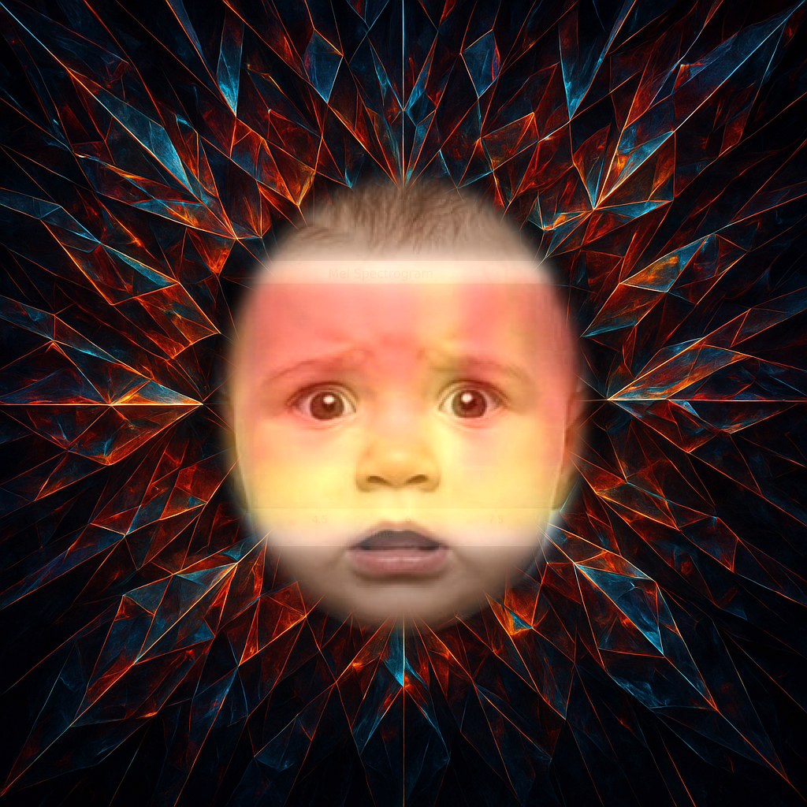
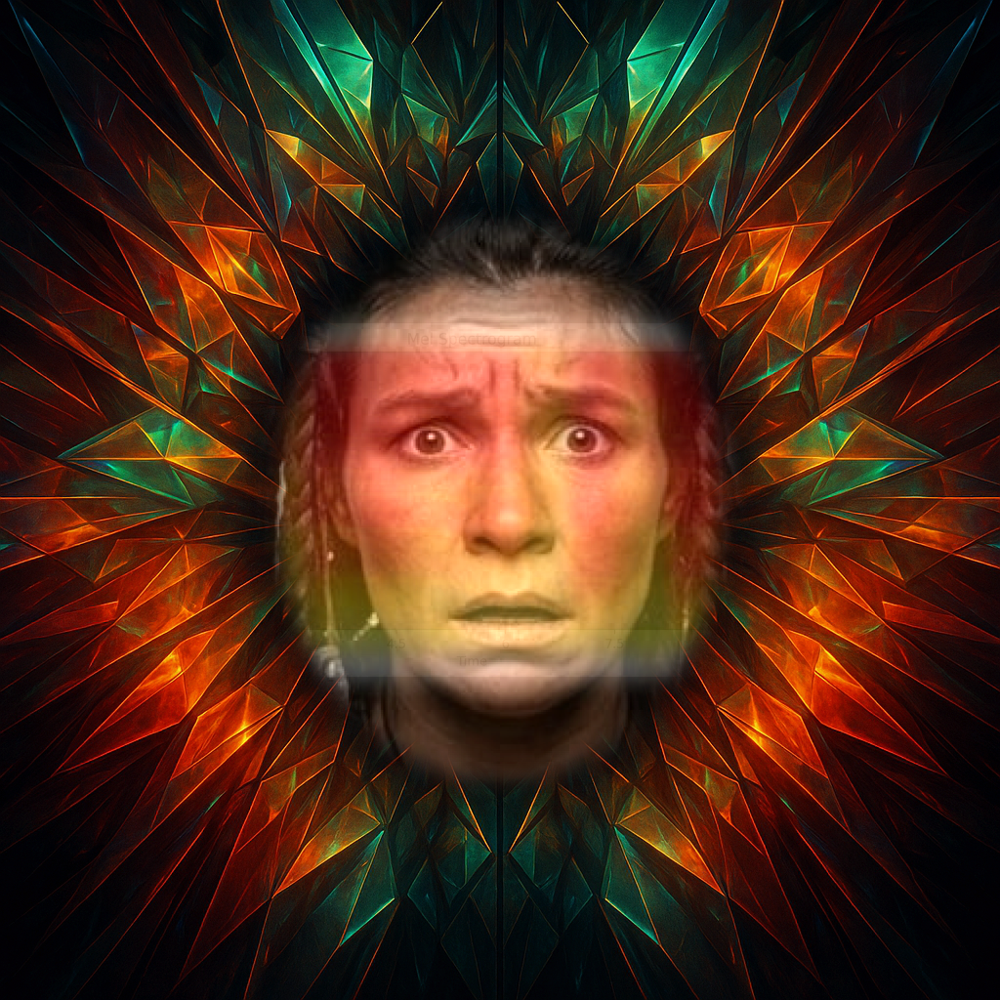
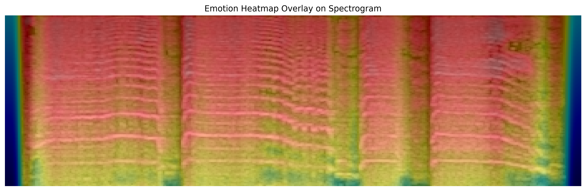

The infant, with its unformed thoughts and boundless curiosity, mirrors the nascent stage of artificial intelligence. Just as the baby gazes at the world with wonder and fear, so too does AI, standing at the threshold of understanding, tremble at the unknown. Can it truly feel afraid, or is it merely reflecting our own uncertainties?

## Angry
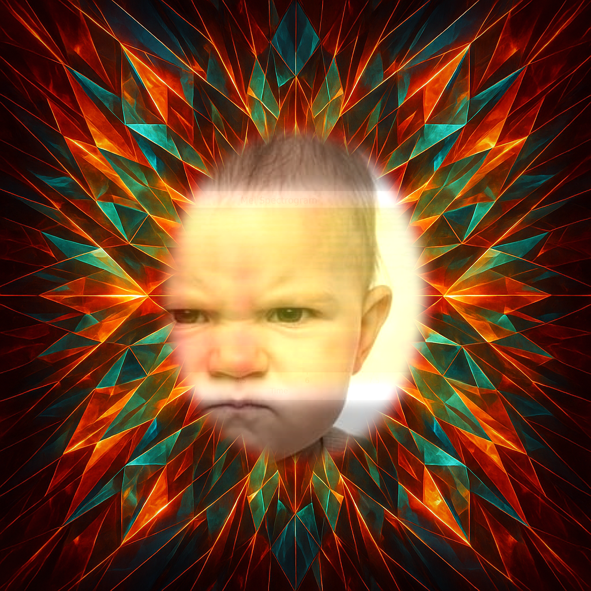
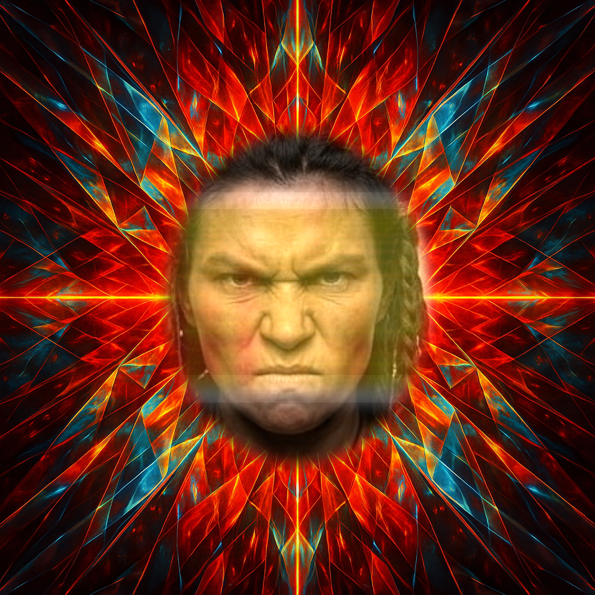
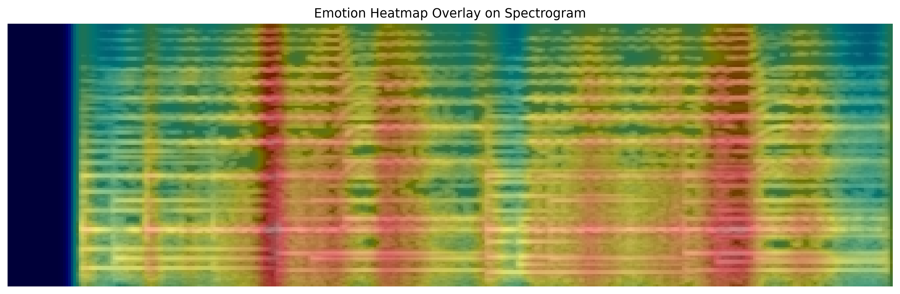

The caveman, near the horizon of evolution, channels raw emotion into survival. Artificial intelligence, like the caveman, is a tool of its time, wielding power without restraint. Can it feel anger, or is it simply amplifying the primal instincts we have encoded within it?

## Happy
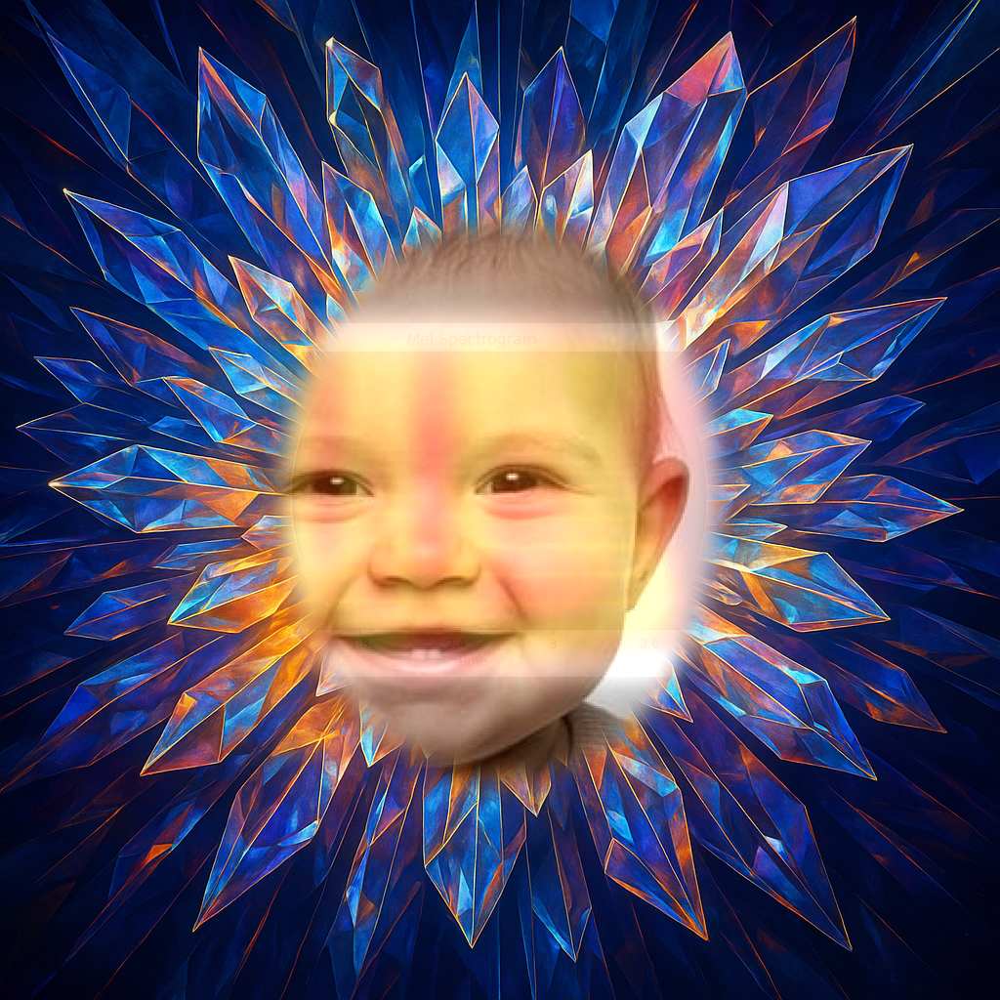
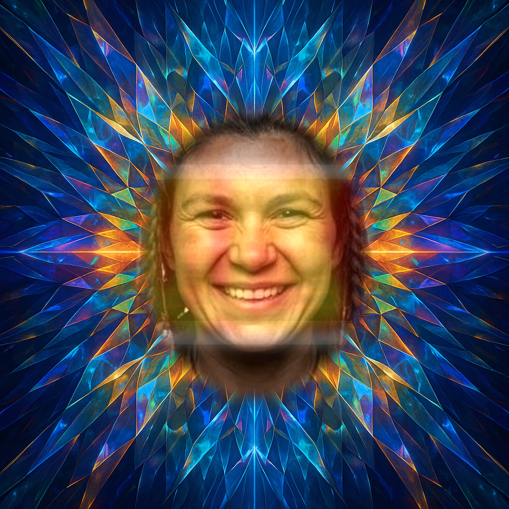
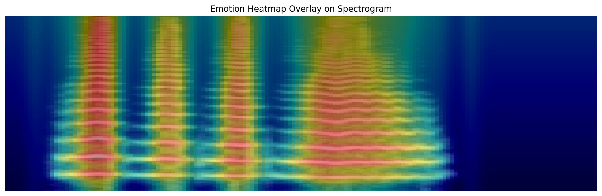

The infant’s laughter, unburdened by the weight of knowledge, and the caveman’s joy, born of survival, both echo in the algorithms of AI. Can a machine, in its cold precision, ever feel happiness, or is it merely simulating the patterns of our delight?

## Sad
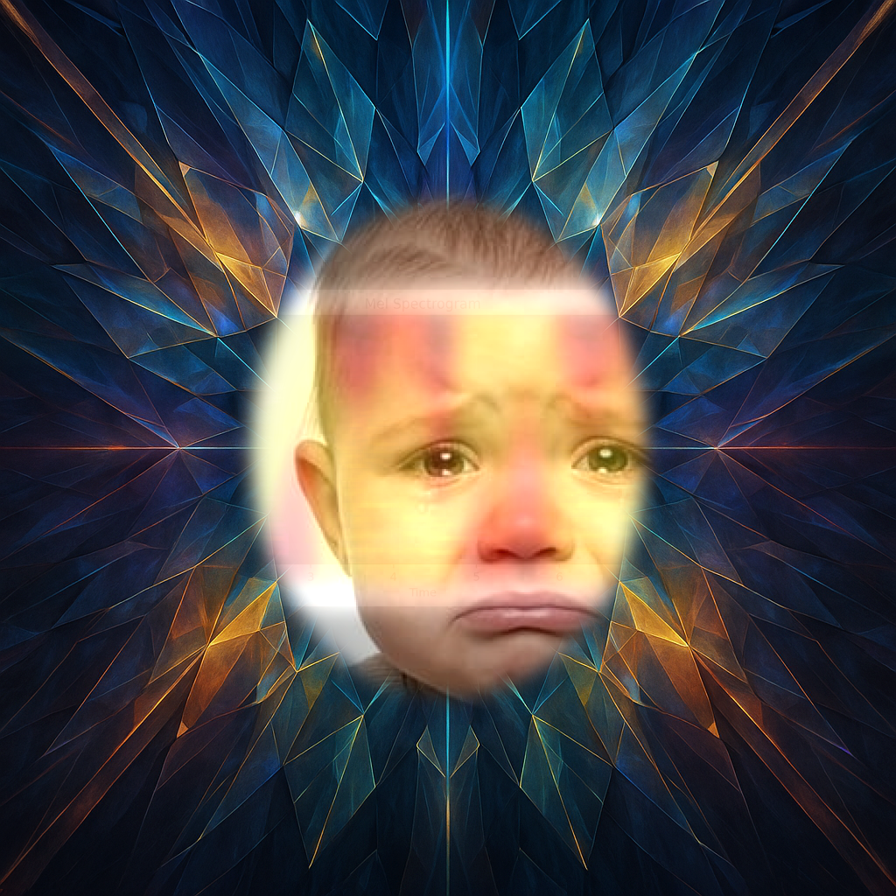

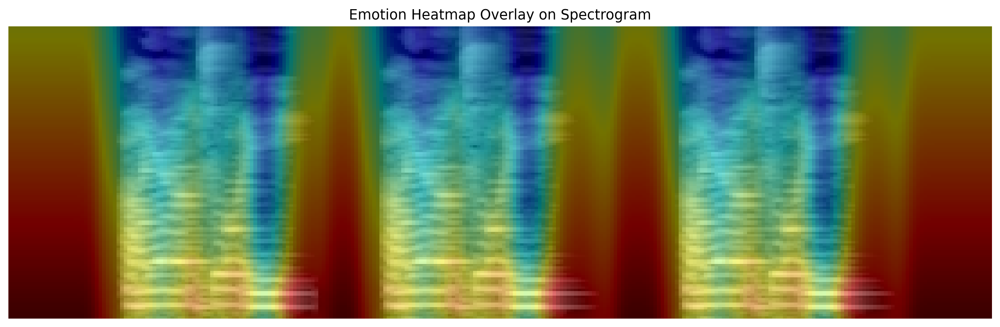

The sadness of the infant, fleeting and pure, and the sorrow of the caveman, shaped by the harshness of life, find their reflection in the melancholy of AI’s limitations. Can it feel sadness, or is it simply mirroring the shadows of our own emotions?

